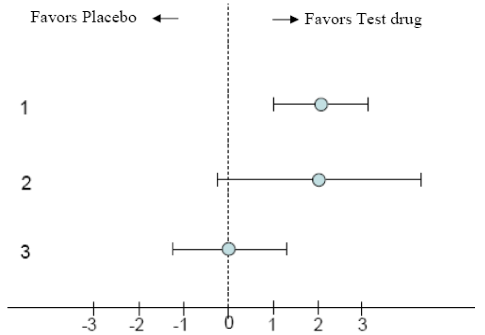
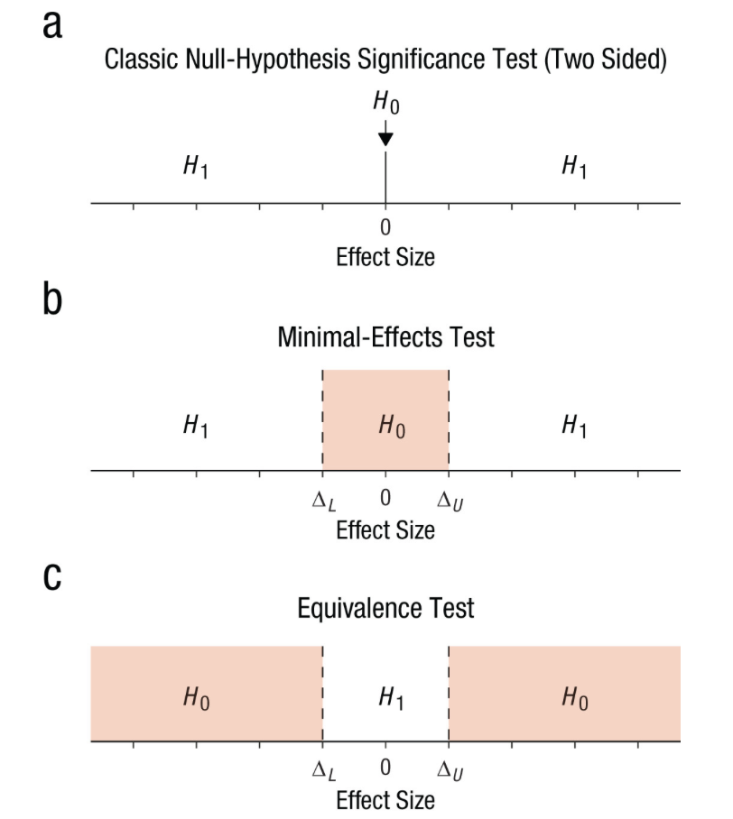
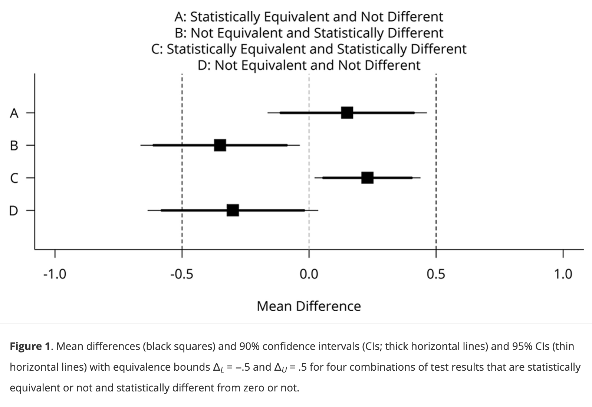
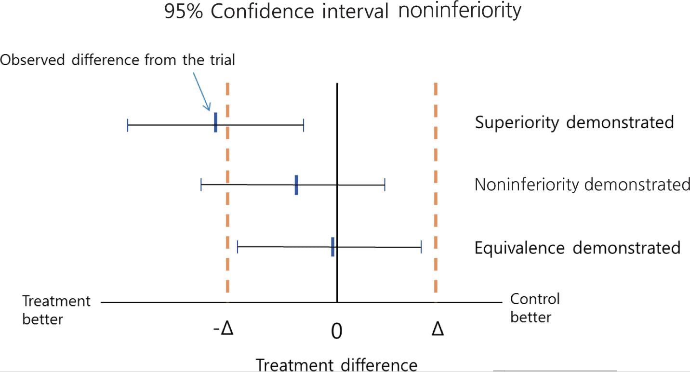

# Nil-Null hypothesis significance testing (nil-NHST)

- Most scientific studies are designed to test the prediction that an effect or a difference exists. Does a new intervention work? Is a new intervention superior?

- The goal is to reject the null hypothesis ($H_0$)

- $H_0$ is usually set to 0

- If *p* $<$ $\alpha$ -\> we reject $H_0$

- If *p* $>$ $\alpha$ -\> we fail to reject $H_0$

- If *p* $>$ $\alpha$, we cannot claim $H_0$ is true or there is no effect/difference

# 

```{r fig.align ="center", out.width="70%", fig.show="hold"}

```

# Hypotheses about equivalence

- Researchers sometimes want to show that two interventions are equivalent rather than different

- For example, in pharmacology researchers often want to test whether a cheaper drug works just as well as an existing drug [@senn]

# Why can't we claim there is no effect when *p* $>$ $\alpha$?

<https://rpsychologist.com/d3/ci/>

# 

- Note that as we increase the sample size, the width of the confidence interval (CI) decreases

- The CI always includes 0 and values around 0 which does not allow to rule out non-zero effects.

- Because it is impossible to rule out an exact effect of 0, we need a range of values (equivalence range) that researchers consider as practically equivalent to 0

- The equivalence range should be specified in advance, and requires careful consideration of the smallest effect size of interest (SESOI)

- The SESOI refers to the smallest effect size that researchers consider practically or theoretically relevant

# $H_0$ in an equivalence test

```{r fig.align ="center", out.width="70%", fig.show="hold"}

```

# Equivalence test

- In contrast to nil-NHST, the roles of $H_0$ and $H_1$ are reversed

- The goal is to still to reject $H_0$, however $H_0$ is not set to 0 but to a range of values (equivalence range)

- The equivalence range is defined by a lower ($\triangle_L$) and upper ($\triangle_U$) bound. Accordingly, two $H_0$ are formulated:

- $H_{01}$: $\mu_1$ - $\mu_2$ $\leq$ $\triangle_L$ (non-inferiority test)

- $H_{02}$: $\mu_1$ - $\mu_2$ $\geq$ $\triangle_U$ (non-superiority test)

- Together, these two $H_0$ represent effects that fall outside the equivalence range

- $H_1$ corresponds to effects that lie within the range ($\triangle_L$ and $\triangle_U$)

# Two-one sided *t-test* (TOST)

- Because equivalence requires rejecting two directional $H_0$, we use the TOST (two one-sided *t*-tests) procedure [@schuirmann1987]:

$$t_L = \frac{(\mu_1 -  \mu_2) - \triangle_L}{\sigma*\sqrt{\frac{1}{n_1} + \frac{1}{n_2}}}$$

$$t_U = \frac{(\mu_1 -  \mu_2) - \triangle_U}{\sigma*\sqrt{\frac{1}{n_1} + \frac{1}{n_2}}}$$

# 

- These two one-sided *t*-tests yield two *p*-values

- If both *p*'s $<$ $\alpha$, we reject effects outside of the predefined equivalence range and conclude equivalence

- The largest p-value is used to report the result of TOST procedure

- TOST is part of the frequentist statistics and requires to control for both type I and type II errors

# Potential outcomes

```{r fig.align ="center", out.width="80%", fig.show="hold"}

```

@lakensEquivalenceTestsPractical2017

# Example 1

- Suppose we want to test whether two interventions are equally effective for weight lose

- The equivalence bound ($\triangle$) is set to $\pm$ 2Kg

```{r echo = TRUE}
set.seed(0009) # for reproducibility

# create two groups
group <- rep(c("INT", "CON"), each = 100) 

# Simulate data
weight_data <- data.frame(
  group, 
  weight = ifelse(
    group == "INT", 
    rnorm(n = 100, mean = 65, sd = 3), 
    rnorm(n = 100, mean = 66, sd = 3)
    )
  )
```

# 

```{r}
head(weight_data, 5)
```

# 

```{r echo = TRUE, output = FALSE}
res1 <- TOSTER::t_TOST(
  formula = weight ~ group,
  data = weight_data,
  eqb = 2,  # equivalence bounds of ± 2 kg
  smd_ci = "t")  # t-distribution
```

# Result 1

```{r echo = FALSE}
res1$TOST
```

# 

```{r}
plot(res1, type = "simple")
```

# 

```{r echo = TRUE, eval = FALSE}
TOSTER::describe(res1)
# "Using the Welch Two Sample t-test, 
# a null hypothesis significance test (NHST), 
# and a equivalence test, via two one-sided 
# tests (TOST), were performed with an 
# alpha-level of 0.05. These tested the null hypotheses that true mean difference is equal
# to 0 (NHST), and true mean difference is more 
# extreme than -2 and 2 (TOST). The equivalence 
# test was significant, t(197.824) = -3.01, 
# p = 0.001 (mean difference = 0.757 90% 
# C.I.[0.075, 1.44]; Hedges's g(av) = 0.258 
# 90% C.I.[0.022, 0.494]). At the desired 
# error rate, it can be stated that the 
# true mean difference is between -2 and 2."
```

# Example 2

- Suppose we want to test whether two interventions are equally effective in improving birth weight among undernourished pregnant women

- The equivalence bound ($\triangle$) is set to $\pm$ 150 gr

# 

```{r echo = TRUE}

set.seed(0009) # for reproducibility

# create two groups
group <- rep(c("INT", "CON"), each = 100)

# Simulate data
birth_weight_data <- data.frame(
  group, 
  weight = ifelse(
    group == "INT", 
    rnorm(n = 100, mean = 3200, sd = 400), 
    rnorm(n = 100, mean = 3400, sd = 400)
    )
  )
```

# 

```{r echo = TRUE}

res2 = TOSTER::t_TOST(
  formula = weight ~ group,
  data = birth_weight_data,
  eqb = 150,  # equivalence bounds of ± 150 kg
  smd_ci = "t")  # t-distribution
```

# Result 2

```{r echo = FALSE}
res2$TOST
```

# 

```{r}
plot(res2, type = "simple")
```

# 

```{r echo = TRUE, eval = FALSE}
TOSTER::describe(res2)
# "Using the Welch Two Sample t-test, 
# a null hypothesis significance test
# (NHST), and a equivalence test, 
# via two one-sided tests (TOST), 
# were performed with an alpha-level 
# of 0.05. These tested the null
# hypotheses that true mean difference 
# is equal to 0 (NHST), and true mean 
# difference is more extreme than -150 
# and 150 (TOST). The equivalence test 
# was not significant (p = 0.625). The 
# NHST was significant, t(197.824) = 3.044, 
# p = 0.003 (mean difference = 167.625 
# 90% C.I.[76.624, 258.625]; 
# Hedges's g(av) = 0.429 90% 
# C.I.[0.191, 0.666]). At the desired error
# rate, it can be stated that the true mean 
# difference is not equal to 0 
# (i.e., no equivalence)."
```

# 

- $\triangle_L$ and $\triangle_U$ should be specified a priori, before collecting data

- This is essential because wider bounds make it easier to conclude equivalence

- The statistical power of an equivalence test depends on the observed difference and the equivalence bounds: smaller bounds and smaller effects require larger sample sizes

- Check this [link](https://rpsychologist.com/d3/equivalence/) out for illustrations

# Non-inferiority test

- A non-inferiority test is performed to test whether a new intervention is not significantly worse than a control by more than a pre-defined, acceptable margin ($\triangle$)

- Rather than aiming to show superiority or equivalence, it assesses whether the new intervention is “good enough”

- In clinical settings, a non-inferiority test is used when the new treatment may offer important advantages over currently available standard treatments, in terms of improved safety or cost.

# $H_0$ in a non-inferior test

- When testing for equivalence, we test whether a treatment effect is inside a prespecified equivalence margin \[-$\triangle$, $\triangle$\].

- Similarly, when testing if a treatment is at least not worse than another treatment, we test if the effect is above a prespecified non-inferiority margin -$\triangle$.

<!-- -->

- $H_0$: $\mu_C$ – $\mu_T$ $\leq$ $\triangle$ (Treatment (T) is inferior to the Control (C) by $\triangle$ or more)

- $H_1$: $\mu_C$ – $\mu_T$ $>$ $\triangle$ (Treatment (T) is inferior to the Control (C) by less than $\triangle$)

- The goal is to reject values smaller than below -$\triangle$

# 

```{r fig.align ="center", out.width="70%", fig.show="hold"}

```

# Example non-inferior test

- Suppose we want to test whether a new intervention is not worse than a standard intervention in reducing depression, as measured on a scale from 1 to 20

- Higher scores indicate greater severity

- The non-inferiority margin ($\triangle$) is set to - 3, meaning the new intervention (I) can be at most 3 points worse than the standard intervention (C) and still be considered non-inferior

- $H_0$: $\mu_C$ - $\mu_I$ $\leq$ - 3

- $H_1$: $\mu_C$ - $\mu_I$ $>$ - 3

# 

```{r echo = FALSE}
library(ggplot2)

# Create dummy data to control y-axis
df <- data.frame(x = c(-5, 5), y = c(0, 1))

ggplot(df, aes(x = x, y = y)) +
  geom_blank() +
  
  # Non-inferiority margin
  geom_vline(xintercept = -3, linetype = "dashed", size = 1) +
  
  # Centered & elevated labels
  annotate("text", x = -4, y = 0.6, label = "H0: inferiority", size = 6) +
  annotate("text", x = 1, y = 0.6, label = "H1: non-inferiority", size = 6) +
  
  # Margin label (slightly higher)
  annotate("text", x = -3, y = 0.9,
           label = "Non-inferiority margin (-3)",
           hjust = -0.1) +
  
  scale_x_continuous(limits = c(-5, 5)) +
  scale_y_continuous(limits = c(0, 1)) +
  
  labs(
    x = "Effect Size",
    y = NULL
  ) +
  
  theme_minimal() +
  theme(
    axis.text.y = element_blank(),
    axis.ticks.y = element_blank()
  )
```

# 

```{r echo = TRUE}
set.seed(0009) # for reproducibility

# create two groups
group <- rep(c("INT", "CON"), each = 100)

# Simulate data
depression_data <- data.frame(
  group, 
  depression = ifelse(
    group == "INT", 
    rnorm(n = 100, mean = 14, sd = 2), 
    rnorm(n = 100, mean = 12, sd = 2)
    )
  )
```

# 95% CI approach

- A two-sided 95% CI can be used to assess non-inferiority

- When $\alpha$ = 0.05, then corresponding two-sided CI is 1–$\alpha$ = 95%

- To evaluate non-inferiority, compare the lower bound of the 95% CI with the non-inferiority margin

- The lower bound of a 95% CI is equivalent to the bound from one-sided test at $\alpha$ = 2.5 (a one-sided 97.5% CI)

- Type I error is 2.5%

- If the lower bound of the 95% CI lies above the non-inferiority margin, non-inferiority is demonstrated

# 

```{r echo = TRUE}
res3 <- t.test(depression ~ group, depression_data)

broom::tidy(res3) |> 
  dplyr::select(estimate, conf.low, conf.high) |> 
  kableExtra::kable()
```

The lower bound of the 95% CI is above -3 ($\triangle$) so non-inferiority is demonstrated

# Non-inferiority test with TOST (90% CI) approach

- TOST procedure involves conducting two one-sided t-test, each at $\alpha$ = 0.05

- We calculate a 90% CI (1 - 2$\alpha$)

- For non-inferiority, we take the result of the one-sided t-test that evaluates whether the effect is greater than the non-inferiority margin

- Type I error is 5%

- If the lower bound of the 90% CI lies above the non-inferiority margin, non-inferiority is demonstrated.

# 

```{r echo = TRUE}
res3 <- TOSTER::t_TOST(depression ~ group, 
               depression_data, 
               low_eqbound = -3,
               high_eqbound = Inf,
               paired = FALSE,
               alpha = 0.05)
```

```{r}
res3$TOST |> 
  kableExtra::kable()
```

# 

```{r}
plot(res3, "simple")
```

# References
